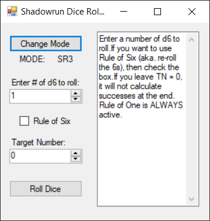

# Shadow Run Dice Utility

Application to automate dice rolls for Shadow Run 3rd and 4th editon.

This application was developed by vegetaman (vegetaman@gmail.com) who allowed me to host his code and binaries to github. More information about this application can be found here:

<https://sites.google.com/site/vegetaman/home/shadowrun/dice>

## Screenshots

Shadow Run 4th edition mode: rule of one glitched roll.

Shadow Run 3rd edition mode with 4 successful rolls.

